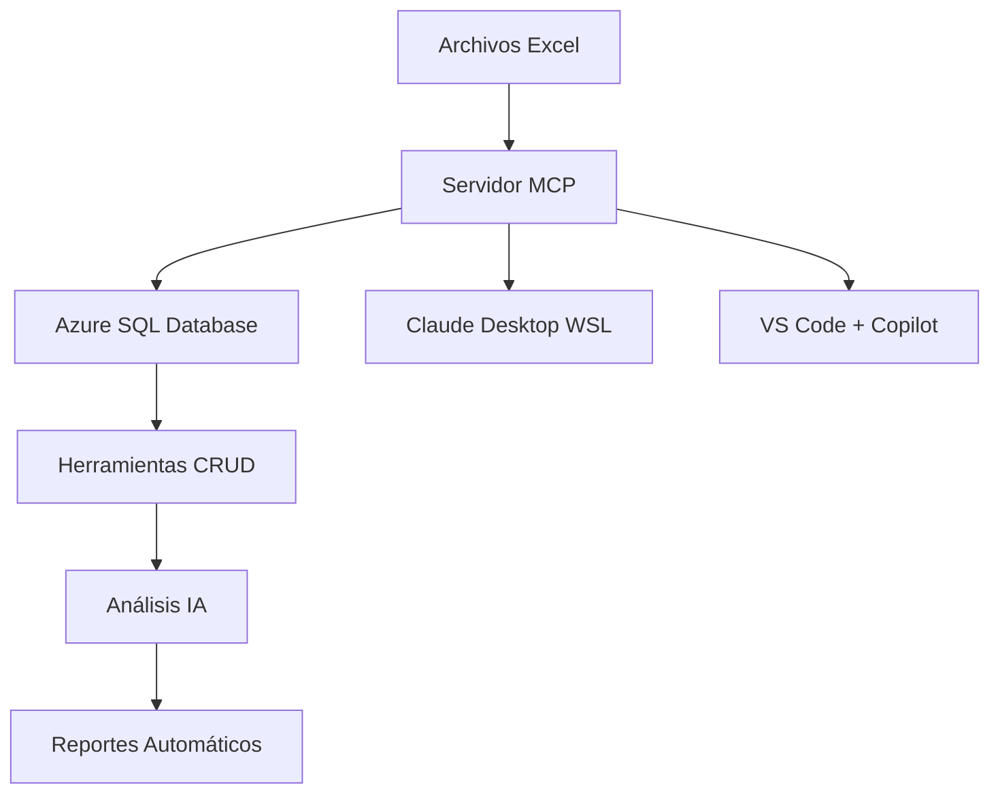

# Sistema Educativo MCP 🎓

Automatización y análisis de datos educativos usando Model Context Protocol (MCP) y Azure SQL Database

   

## 🎯 Visión del Proyecto

Crear un ecosistema completo de herramientas MCP para automatizar procesos educativos repetitivos y profundizar el análisis de datos usando IA. El sistema está diseñado para oficinas educativas que manejan:

- **Mantenimiento de escuelas** (excedentes, necesidades de docentes, recursos)
- **Análisis de datos educativos** (indicadores, estadísticas, tendencias)
- **Gestión de centros de trabajo** (alumnos, docentes, autoridades)
- **Reportes automáticos** y dashboards interactivos

## 🏗 Arquitectura



### Stack Tecnológico
- **Backend**: Python 3.12+ + FastMCP (MCP SDK 1.9.3)
- **Base de Datos**: Azure SQL Database
- **Protocolo**: Model Context Protocol (MCP)
- **IA Integration**: Claude Desktop + GitHub Copilot
- **Desarrollo**: VS Code con herramientas MCP
- **Entorno**: Dual Linux/WSL + Windows

## 🚀 Estado Actual

### ✅ Implementado (v2.0)

**Servidor MCP Completo**
- 8 herramientas MCP funcionales y probadas
- Carga segura de variables de entorno (.env)
- Gestión de DataFrames en memoria
- Análisis automático de datos educativos
- Conexión Azure SQL Database operativa

**Integración Dual IA**
- ✅ **Claude Desktop**: Configurado e integrado via WSL
- ✅ **GitHub Copilot**: Configuración VS Code funcional
- ✅ **Herramientas visibles**: 8 tools detectadas correctamente
- ✅ **Ejecución exitosa**: Comandos MCP funcionando
- ✅ **Análisis automático**: Procesamiento de datos de centros educativos

**Infraestructura Productiva**
- ✅ Conexión Azure SQL Database establecida (drvii-apps.database.windows.net)
- ✅ Entorno virtual Python configurado con 15+ dependencias
- ✅ Repositorio GitHub con historial completo
- ✅ Configuración .vscode/ para desarrollo
- ✅ Configuración WSL para Claude Desktop

## 🛠 Herramientas MCP Disponibles

### 📊 Análisis de Archivos Excel
1. **`debug_info()`** - Diagnóstico completo del sistema
2. **`list_excel_files()`** - Lista archivos Excel disponibles
3. **`read_excel_file()`** - Lee archivos Excel genéricos
4. **`get_excel_info()`** - Información detallada de archivos
5. **`excel_summary()`** - Resumen estadístico completo

### 🎓 Análisis Educativo Específico
6. **`read_schools_data()`** - Carga datos de centros educativos
7. **`analyze_schools_by_municipality()`** - Análisis por municipio
8. **`list_loaded_datasets()`** - Gestión de datasets en memoria

## 📊 Capacidades de Análisis

El sistema puede procesar y analizar:
- **Centros educativos** de múltiples regiones
- **Niveles educativos** diversos (Preescolar, Primaria, Secundaria, etc.)
- **Distribución geográfica** por municipios y zonas
- **Datos de matrícula** y estadísticas estudiantiles
- **Tipos de sostenimiento** (Público, Particular, etc.)

## 🆕 Actualización Reciente (2025-06-11)

### ✅ Configuración Claude Desktop Completada
- **Integración WSL**: Servidor MCP ejecutándose desde Windows via WSL
- **8 Herramientas MCP**: Todas detectadas y funcionales en Claude Desktop  
- **Azure SQL**: Conexión establecida y operativa
- **Dependencias**: 15+ paquetes actualizados en requirements.txt

### 🔧 Dependencias Principales
```txt
mcp==1.9.3                 # MCP SDK oficial
pandas>=2.0.0              # Análisis de datos
python-dotenv>=1.0.0       # Variables seguras
pyodbc>=4.0.39             # Azure SQL conectividad
pydantic>=2.0.0            # Validación datos
openpyxl>=3.1.0            # Archivos Excel
sqlalchemy>=2.0.0          # ORM base datos
loguru>=0.7.0              # Logging avanzado
rich>=13.0.0               # Output mejorado
```

## 📋 Próximos Desarrollos

### 🔄 En Progreso
- **Documentación para equipo** - Guía para replicar setup
- **Herramientas CRUD** avanzadas - Create, Read, Update, Delete para escuelas
- **Análisis predictivo** - Modelos de tendencias educativas

### 📅 Roadmap

**Fase 3: Automatización Avanzada**
- Detección automática de excedentes de personal
- Cálculo de necesidades por zona/nivel
- Reportes automáticos periódicos
- Alertas de indicadores críticos

**Fase 4: Análisis Predictivo**
- Modelos de predicción de matrícula
- Optimización de distribución de recursos
- Dashboards interactivos en tiempo real
- Integración con sistemas gubernamentales

## 🛠 Instalación y Configuración

### Prerrequisitos
- Python 3.12+
- Claude Desktop (Windows)
- VS Code con GitHub Copilot
- WSL2 (Ubuntu)
- Acceso a Azure SQL Database
- Git configurado

### Setup Inicial

#### 1. Clonar y configurar entorno
```bash
# Clonar repositorio
git clone https://github.com/Ernest-Alf/mcp-azure-schools.git
cd mcp-azure-schools

# Crear entorno virtual
python -m venv venv
source venv/bin/activate  # Linux/WSL
# venv\Scripts\activate   # Windows

# Instalar dependencias
pip install -r requirements.txt

# Configurar variables de entorno
cp .env.example .env
# Editar .env con tus credenciales de Azure
```

#### 2. Configuración Claude Desktop (Windows)
```json
# Archivo: %userprofile%\AppData\Roaming\Claude\claude_desktop_config.json
{
  "mcpServers": {
    "azure-schools-mcp": {
      "command": "wsl",
      "args": [
        "-d", "Ubuntu",
        "/home/ernesto/proyectos/mcp-azure-schools/venv/bin/python",
        "/home/ernesto/proyectos/mcp-azure-schools/src/azure_schools_mcp/server.py"
      ]
    }
  }
}
```

#### 3. Configuración VS Code + MCP
Los archivos `.vscode/settings.json` ya están configurados.
Las herramientas MCP aparecerán en GitHub Copilot Chat automáticamente.

### 🧪 Testing

```bash
# Modo test básico
python src/azure_schools_mcp/server.py test

# Test desde Windows via WSL
wsl -d Ubuntu /path/to/venv/bin/python /path/to/server.py test

# Verificar dependencias
python -c "from mcp.server.fastmcp import FastMCP; import pyodbc; print('✅ MCP y PyODBC OK')"
```

## 🔧 Uso de Herramientas MCP

### En Claude Desktop
```
# Diagnóstico del sistema
Ejecuta debug_info para mostrar el estado completo

# Análisis de archivos
Lista todos los archivos Excel disponibles

# Carga de datos educativos
Usa read_schools_data para cargar datos de centros educativos y muéstrame estadísticas por municipio

# Análisis avanzado
Ejecuta analyze_schools_by_municipality con el dataset cargado
```

### En GitHub Copilot (VS Code)
```
# Listar archivos Excel
Ejecuta list_excel_files para mostrarme los archivos disponibles

# Analizar datos de escuelas
Usa read_schools_data para analizar centros educativos

# Información detallada
Ejecuta get_excel_info para obtener la estructura completa del archivo
```

## 📁 Estructura del Proyecto

```
mcp-azure-schools/
├── .vscode/                    # Configuración VS Code + MCP
│   ├── settings.json          # Configuración del agente
│   └── mcp.json              # Definición de herramientas
├── excel_files/              # Archivos Excel para análisis
│   └── [archivos_educativos].xlsx
├── src/
│   └── azure_schools_mcp/    # Servidor MCP principal
│       ├── __init__.py
│       └── server.py         # 8 herramientas MCP
├── scripts/                  # Scripts de utilidad
├── docs/                     # Documentación del proyecto
├── tests/                    # Tests automatizados
├── venv/                     # Entorno virtual Python
├── .env.example              # Template de variables de entorno
├── .env                      # Variables reales (no en Git)
├── requirements.txt          # Dependencias Python actualizadas
├── .gitignore               # Archivos excluidos de Git
└── README.md                # Este archivo
```

## 🤝 Casos de Uso

### Para Mantenimiento Educativo
- Identificar excedentes de personal por nivel/zona
- Calcular necesidades de docentes en tiempo real
- Generar reportes de mantenimiento automáticos
- Optimizar distribución de recursos entre escuelas

### Para Análisis de Datos
- Tendencias de matrícula por región/municipio
- Indicadores de eficiencia educativa
- Comparativas entre niveles educativos
- Predicciones de crecimiento estudiantil

## 📊 Métricas de Rendimiento

- **Tiempo de respuesta**: < 2 segundos por consulta MCP
- **Archivos Excel procesados**: Soporte para múltiples archivos simultáneos
- **Herramientas MCP activas**: 8/8 funcionando ✅
- **Integración IA**: Claude Desktop ✅ + GitHub Copilot ✅
- **Conectividad Azure SQL**: Establecida y operativa ✅

## 🔄 Workflow de Desarrollo

1. **Desarrollo local** con VS Code + GitHub Copilot
2. **Testing** de herramientas MCP en modo test
3. **Validación** en Claude Desktop via WSL
4. **Commit & Push** con mensajes descriptivos
5. **Documentación** actualizada en cada release

## 🐛 Troubleshooting

### Servidor MCP no aparece en Claude Desktop
```bash
# Probar servidor MCP desde WSL
python src/azure_schools_mcp/server.py test

# Test desde Windows via WSL
wsl -d Ubuntu /path/to/venv/bin/python /path/to/server.py test

# Verificar configuración claude_desktop_config.json
cat "%userprofile%\AppData\Roaming\Claude\claude_desktop_config.json"

# Reiniciar Claude Desktop como administrador
```

### Error de conexión Azure SQL
```bash
# Verificar variables de entorno
cat .env

# Test de conexión
python -c "import pyodbc; print('✅ PyODBC disponible')"

# Verificar string de conexión
python -c "import os; from dotenv import load_dotenv; load_dotenv(); print('Server:', os.getenv('AZURE_SQL_SERVER'))"
```

### Dependencias faltantes
```bash
# Verificar MCP SDK
python -c "from mcp.server.fastmcp import FastMCP; print('✅ MCP OK')"

# Reinstalar dependencias críticas
pip install --upgrade mcp python-dotenv pyodbc pydantic

# Verificar entorno virtual
which python  # Debe apuntar a tu venv
```

## 📞 Contribución y Soporte

- **Issues**: [GitHub Issues](https://github.com/Ernest-Alf/mcp-azure-schools/issues)
- **Discusiones**: [GitHub Discussions](https://github.com/Ernest-Alf/mcp-azure-schools/discussions)
- **Email**: [Contacto del mantenedor]

## 📄 Licencia

Este proyecto está bajo la Licencia MIT. Ver `LICENSE` para más detalles.

---

**Mantenido por**: Ernest-Alf  
**Última actualización**: Junio 2025  
**Versión**: 2.0.0  
**Estado**: ✅ Producción - Claude Desktop Integrado
